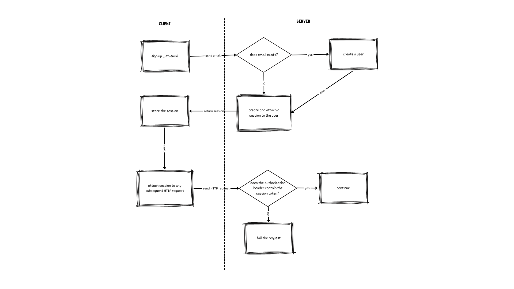
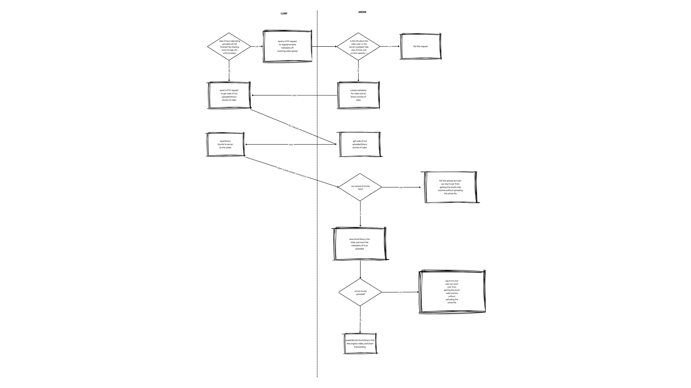

# Playhouse

## What is it?

Playhouse is a side project of mine that can help you build your own video streaming services on your own server. It’s not a well-crafted service, but it does its job.

## What tech is it built on?

### Web Front-end

- [Nginx](https://nginx.org/en/)
    - For retrieving front-end resources
- Html
- Css
- Vanilla Javascript

### Web Back-end

- [Go](https://go.dev/)
    - [Chi HTTP Framework](https://go-chi.io/#/)
    - [Gorilla WebSocket](https://github.com/gorilla/websocket)
- [CockroachDB](https://www.cockroachlabs.com/)

### Others

- [Ffmpeg](https://ffmpeg.org/ffmpeg.html)
    - for video transcoding
- [Docker](https://www.docker.com/)
- [K6](https://k6.io/docs/)
    - for rough integration testing and load testing

## How do we run this project on your local environment?

- Install [Docker](https://docs.docker.com/desktop/) if you don’t have it.
- `git clone` this project
- Assume the project directory is named `playhouse` , `cd playhouse` or the name you gave it to the project directory
- `docker compose up -d`
- Open your browser with `http://localhost:1234`
- Hope you don’t get any error
- Done
- If you just want to run the `server` service without docker, then:
    - `ENV_PATH` is the environment variable that specifies the environment file it works with, specify it by the file `./server/conf/.env_local` . ( we are under the `playhouse` directory in case you forgot) Or you are good to modify it or to even create your own.
- If you want to run tests in the `./test` directory, then:
    - Install [K6](https://k6.io/docs/get-started/installation/), a great tool for load testing, integration testing, …etc.
    - cd `./test`
    - `k6 run uploadchunk.js`

## What are the constraints it has?

- The size of vide you can upload is up to **3GB** .
    - Why? The server I tested on only has 64GB disk space, I want to make it to store 15 - 20 videos at most. Of course you can modify it to any size you want.
- The maximum video uploading it can handle are **two sessions** at any moment.
    - Why? The server I tested on only has 4GB RAM, the transcoding process takes 500GB regardless of the size of the video, so two sessions should be a safe choice.
- Only `.mp4` video is supported.
    - Why? As more formats means I need to handle more transcoding stuff, I’m not an expert on this, so I only stick to the ones that are easy to handle. You can change it obviously.
- We delete all data(video files, records in database, ….) **every hour**.
    - Why? I don’t want to pay more money if I deploy this project on cloud.
- Why do we have so few video sessions to be upload?
    - The bottlenecks lie on the transcoding process. It uses [Ffmpeg](https://ffmpeg.org/ffmpeg.html) to transcode the video file into files that are able to be streamed. We use it inside the `server` service for ease of use, however if you want it to more scalable, consider to decouple it or even to use third-party transcoding services.

## How does it work?

It supports the following functionalities

- email sign up
- upload videos
- stream videos
- list all uploaded videos

### Email Sign Up

### Upload Videos

### Stream Videos

- After a video is transcoded, it would have the following files
    - A manifest file
        - This file showing information about sets of timeline, duration, resolution of frames, codecs, bitrate, ….etc.
    - A few content files
        - These files are content of the video that in different codecs
- When a video player starts
    - If a video is being transcoded or service is not available, then a warning is shown
    - Otherwise it would
        - Fetch the manifest file first.
        - Then fetch the content file based on the interaction between users and the player, by with the info in the manifest file.

### List All Uploaded Videos

- All videos uploaded in the **same session** would be shown on the home page.

## What improvements can it use?

- UI rebuilding
- Scalable transcoder
- Unit tests and more integration and load tests
- Pause, resume, and cancel upload sessions
- Log enrichment and monitoring
- Performance monitoring
- More video formats to transcode
- …..
